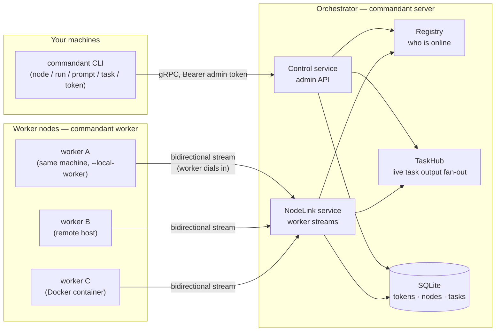
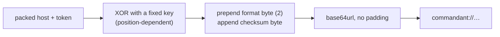
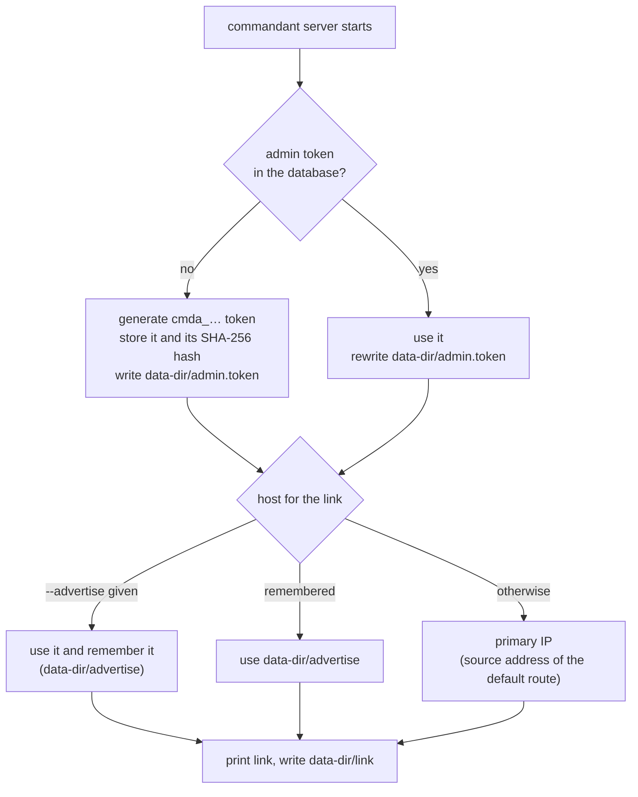
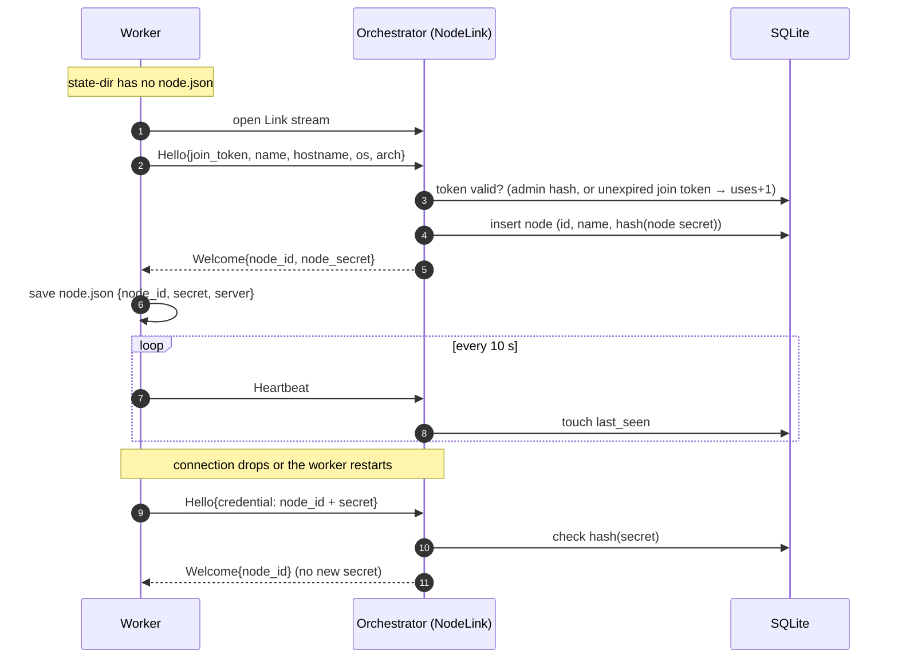
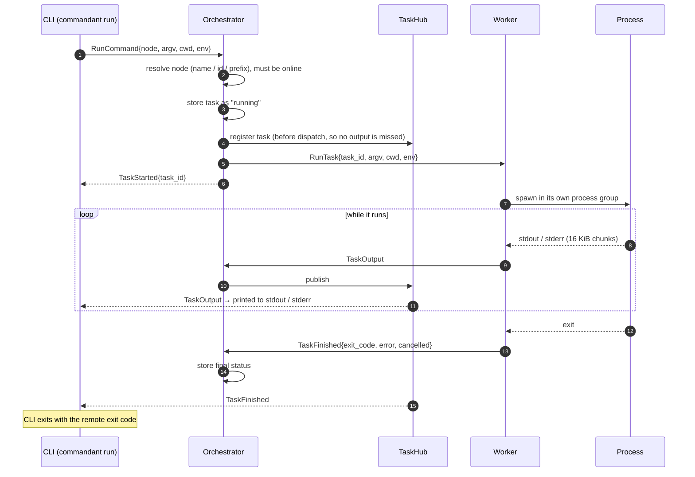
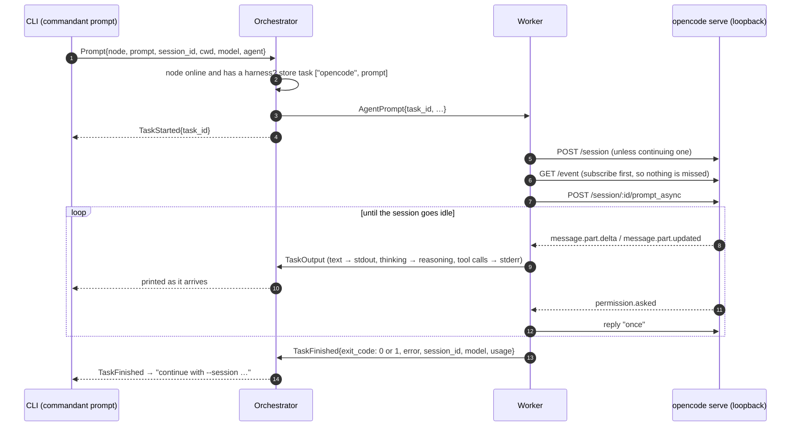
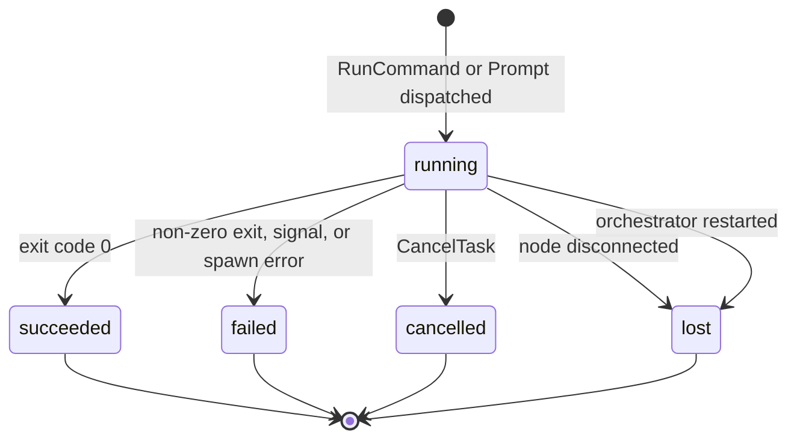
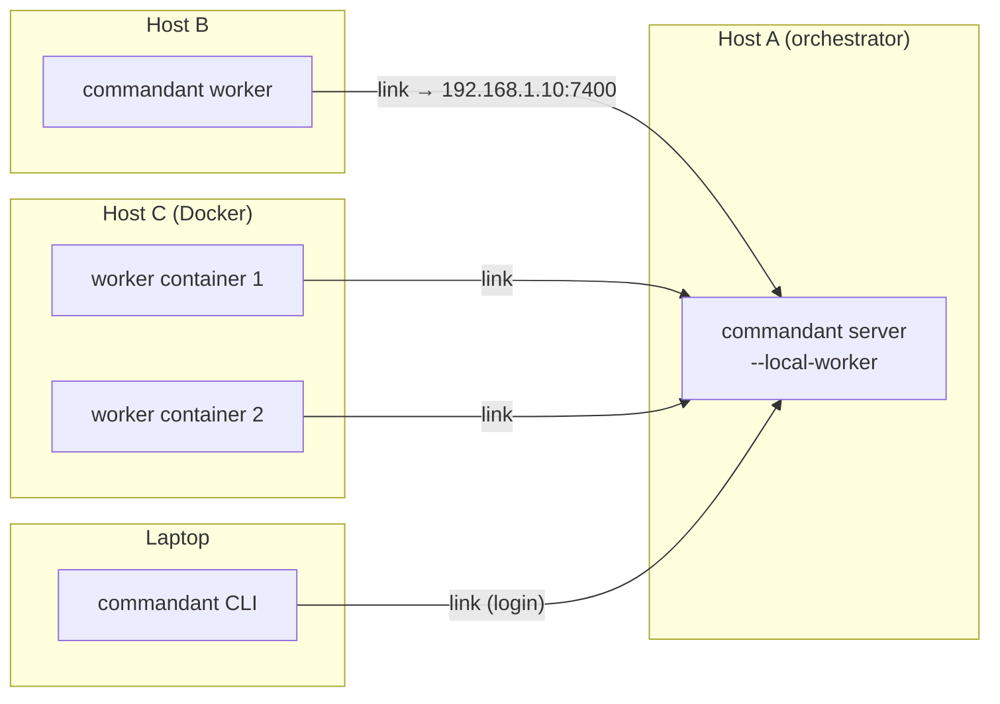

# Architecture

How Commandant's pieces fit together. For the code layout, see [crates.md](crates.md).

## Overview



- **One port (7400) serves two gRPC services.** `Control` is for the CLI.
  `NodeLink` is for workers.
- **Workers always initiate the connection.** The orchestrator never connects
  to a worker; it pushes commands down the stream the worker opened. That's why
  workers can sit behind NAT or firewalls.
- **Durable state lives in SQLite** (tokens, nodes, task history). **Live state
  lives in memory**: which connection belongs to which node (Registry) and which
  CLI streams are watching which task (TaskHub).

## The connection link

```
commandant://AuMPUzAc6IS5ocQ1a_7AWy_ocXe-CvHX8jw
             └──── opaque payload ────────┘
```

The payload packs the host and the secret as bytes:

| Bytes | Content |
|---|---|
| 1 | address kind: IPv4, IPv6 or a name, plus a flag when a port follows |
| 4, 16 or 1 + length | the IP, or the name's length and the name |
| 2, only with the flag | the port, when it isn't 7400 |

With several addresses, a count byte comes first and the address rows repeat.
| 1 | token kind: `cmda`, `cmdj`, `cmdn`, or 0 for any other text |
| the rest | the token's hex as raw bytes (16 for new tokens), or its text |

A new admin link for `192.168.1.10:7400` is 1 + 5 + 17 + 1 = 24 bytes, so 32
characters after `commandant://`.



This is **obfuscation, not encryption**: the key is in the source, so anyone
with the link can recover the token. It keeps the token and IP from being read
over a shoulder or grepped out of logs, and the checksum rejects truncated or
mistyped links. The format byte leaves room for a future format; format 1, the
older `token@host:port` text, still parses. Parsers also
accept the plain `commandant://<token>@<host>:<port>` form.



The same secret works in two places:

- **CLI** (`login`): used as the admin bearer token on every Control call.
- **Worker** (`worker <link>`): used as a join token, but only the first time.
  In return the worker gets its own node credential.

A link can carry several addresses (format 3: a count byte, then each
address, then the token). The server puts the ones given with
`--advertise a,b` first, then the address it detected for this machine.
Clients, workers included, try all of them at once and keep the first that
answers, so one link works from outside (a public name) and inside (the LAN
address). In WSL 2's default NAT networking the detected address is WSL's
own, which only Windows reaches: the server warns, and the fix is WSL's
mirrored networking, or a port forward from Windows plus
`--advertise <Windows' LAN address>`.

Before connecting, every client resolves the link's host. If one of the
resulting addresses belongs to the local machine (it can `bind()` to it), the
client connects to `127.0.0.1` instead.

## Tokens and credentials

| Prefix | Name | Created by | Used for | Lifetime |
|---|---|---|---|---|
| `cmda_` | admin token | first server start | Control API; also valid as a join token | permanent |
| `cmdj_` | join token | `commandant token create` | enrolling one (or, `--reusable`, many) workers | TTL, default 1 h |
| `cmdn_` | node secret | orchestrator, at join | a worker reconnecting as itself | until `node rm` (which disconnects it at once) or a reset; a worker started with a link joins afresh when its saved secret is refused |

A node secret belongs to one worker at a time: the worker locks the state
directory holding it, and a second worker on the machine takes another
directory, hence another node. Should the same secret still turn up on two
connections, the orchestrator keeps the newer one and tells the older worker
why, which stops it instead of letting the two replace each other in turn.

Only SHA-256 hashes of these are checked, and they are compared in constant time.
The admin token is also kept in full, so the database alone brings the same link
back. A database from before that only has its hash takes the token from
`admin.token` once. The database file (`<data-dir>/commandant.db`) is readable by
its owner only. `server --reset` deletes it, together with `admin.token`, `link`
and the local worker's credentials, which only work with that database.

## Worker lifecycle



- If no message arrives for **30 s**, the orchestrator drops the connection and
  marks the node offline.
- The worker reconnects with exponential backoff (1 s → 30 s). It gives up only
  on fatal errors: bad credentials, a name that's already taken, or bad input.
- If a node reconnects while an old connection is still registered, the new one
  **replaces** it. Every connection has a unique `conn_id`, so a stale connection
  closing late can't evict the new one.

## Running a task



**Cancelling** (`task cancel <id>` or Ctrl-C during `run`): the orchestrator
sends `CancelTask` down the worker's stream. The worker sends `SIGKILL` to the
task's whole process group, so child processes die too, and reports
`TaskFinished{cancelled: true}`.

**Slow viewers.** The TaskHub keeps a 4096-event buffer per task. A CLI that
falls behind sees a `[commandant: N output chunks dropped]` note, but the task
itself isn't affected.

## Prompting a coding agent

A worker started with `--harness opencode` installs OpenCode if needed and keeps
`opencode serve` running on loopback. It lists `harness:opencode` in its
`Hello` capabilities, and `can-host:<name>` for every harness it could start;
the orchestrator keeps both with the live connection.

**Harnesses.** In the worker, a harness is the `Harness` trait: `prompt` runs
one prompt and streams its output, `options` lists what a prompt can choose
(switching an MCP server first if asked), and `sessions` lists the saved ones.
The worker's loop only sees the trait, and reports errors the same way for
every harness. A new one is a `HarnessKind` variant, an implementation, and a
line in `harness::start`; the orchestrator and the clients only see its name.

**Starting one later.** A worker started without `--harness` hosts none.
`StartHarness` asks it to start one it can host. It is a question like
`ListAgentOptions`, with 10 minutes to answer since the harness may have to be
installed. The worker starts it once (a second start, or another harness, is
refused) and keeps it until it stops, then answers `HarnessStarted` with what
it now hosts, which the orchestrator records on the connection. The TUI offers
it when a node without an agent is opened.

**Claude Code.** The other harness runs the `claude` CLI itself, once per
prompt: `claude -p --output-format stream-json --include-partial-messages`,
with `--session-id <new uuid>` (so the session is claimed before it starts)
or `--resume <id>` in the session's own directory, the prompt on stdin, and
`--model`/`--effort`/`--agent`. Text and thinking deltas stream as output,
tool calls as notes; cancelling kills its process group. Its options come
from a `claude` given no prompt: the SDK's `initialize` and `mcp_status`
control requests answer with its agents, models and efforts, commands and
MCP servers without calling the model. Sessions are read from
`~/.claude/projects/*/<id>.jsonl`. It stays on the subscription: API key
variables are removed, the `init` event's `apiKeySource` must be `none`, and
signing in means `claude auth status` saying `claude.ai`, or a token from
`claude setup-token` given as `CLAUDE_CODE_OAUTH_TOKEN`.

**MCP servers load late.** OpenCode lists its MCP servers, and its commands
(MCP prompts among them), only once those servers have connected, which can
take 5 to 15 s after it starts. So the options wait at most 2 s for them: past
that they answer with the agents and models, `loading` set and no commands or
MCP servers, and the TUI asks again 3 s later. A picker asked for meanwhile
opens when the answer comes. The worker asks for the commands as soon as it
starts OpenCode, to get the MCP servers connecting early.



**Cancelling** aborts the session (`POST /session/:id/abort`) instead of
killing a process. The OpenCode server keeps running for the next prompt.

**Choices.** `GetAgentOptions` asks a node which agents, models and thinking
efforts its harness offers, so the TUI can show them. It is not a task: the
orchestrator sends `ListAgentOptions{request_id}` down the link, waits up to
15 s for the matching `AgentOptions`, and returns it. The worker builds the
answer from OpenCode's `GET /agent`, `/config/providers`, `/config`, `/command`
(commands, skills and MCP prompts) and `/mcp`. `SwitchMcpServer` is the same
round trip with a `McpSwitch` in `ListAgentOptions`: the worker calls
`POST /mcp/:name/connect` or `/disconnect` first, then answers with the
options, so the caller sees the new status.

**Commands and skills.** A prompt with `command` set runs that command through
`POST /session/:id/command`, the prompt being its arguments. The worker checks
the name against `/command` first (OpenCode answers an unknown one with a bare
500). That request only returns once the turn is over, so it runs beside the
event stream, which drives the output and the end of the turn as for a plain
prompt; cancelling still aborts the session.

**Sessions side by side.** Each prompt is its own task, so a worker runs any
number at once, in one OpenCode server: the orchestrator doesn't limit them,
and each prompt follows only its own session's events. What a worker refuses
is a second prompt to a session still answering one, which OpenCode would
queue and whose replies would mix. `ListAgentSessions` is a question like
`ListAgentOptions`: the worker lists OpenCode's top-level sessions in every
directory (`GET /experimental/session`, else `/session`), latest first, and
marks those it is running a prompt in. The TUI uses it to resume a session,
and `node sessions` prints it. Resuming one also asks `GetSessionHistory`, the
same kind of question: the worker reads `GET /session/:id/message` and answers
with the session's prompts, replies, thinking and tool calls (the latest 300),
which the chat puts before anything said since.

**Projects.** `PrepareProject` and `ListProjects` are questions any worker
answers, harness or not, with up to 10 minutes for a clone. A project is a
repository the node cloned; each clone is a copy with a random 8-character
id, `<state>/projects/<name>/<id>`. `PrepareProject` always makes a new copy,
cloning with libgit2 (`git2`) through a hidden `.cloning-<id>` directory so a
failed clone leaves nothing; given a project's name, it clones the origin of
one of its copies. Credentials are tried as git would, once each: the SSH
agent, the usual key files, the credential helper, never a prompt.
`ListProjects` lists the copies, latest first, with their branch and the
titles of the harness's sessions whose directory is the copy. Joining a copy
is the TUI's alone: the copy's path becomes the session's `cwd`. A started
session keeps its directory, so moving takes a new one.

**One harness, many sessions.** A worker runs at most one harness, whatever
the number of sessions, projects and copies. OpenCode is one `opencode serve`
for all of them, every call naming its directory. Claude Code has no
long-running process: `claude` runs for one prompt and exits, and one
process can only hold one session.

**Signing in to model providers.** `ListProviders` and `ProviderAuth` are
questions too. In the TUI, `/providers` lists every provider the node's
OpenCode knows (signed-in ones first); choosing one offers its sign-in
methods, and Sign out. An API key is typed into a masked prompt and never
shown in the thread. OAuth is two steps: the worker starts it and the TUI
shows the URL and instructions; then either the user pastes back the code the
page shows, or the worker waits (up to 10 minutes) for the browser sign-in to
finish. A browser method that redirects to `localhost` only works from a
browser on the node itself, so the TUI says to use a headless method otherwise.
OpenCode only lists the new provider's models after reloading, which would
abort the prompts running, so the worker reloads at the next options request
or prompt that finds none running, and the TUI asks for the options again.
Credentials travel as plainly as the rest of the gRPC traffic (see below).

## Task states



## Deployment shapes



Everything connects to a single address, and the same link works everywhere.
All traffic is plaintext today, so that address should be on a private network
(LAN, VPN, Tailscale).

## What's next

- **More harnesses.** OpenCode and Claude Code sit behind the `Harness`
  trait. A worker hosts one at a time; hosting several would need prompts to
  name theirs.
- **Interactive agents.** Questions and permission requests are auto-answered
  today. Forwarding them to the CLI would use the remaining reserved fields
  (`WorkerMsg` 14–19, `OrchestratorMsg` 15–19).
- **A fuller TUI.** `commandant tui` chats with one node's agent through the
  same `Control` API. Next: answering the agent's permission requests there.
- **TLS** for the gRPC port.
