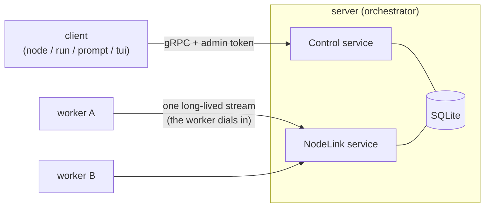
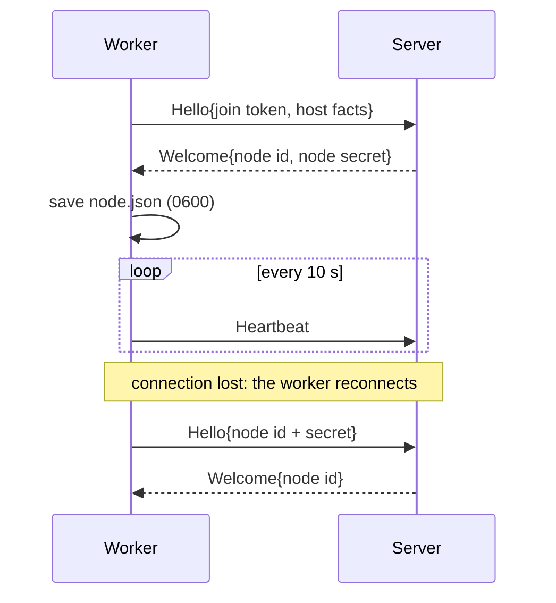
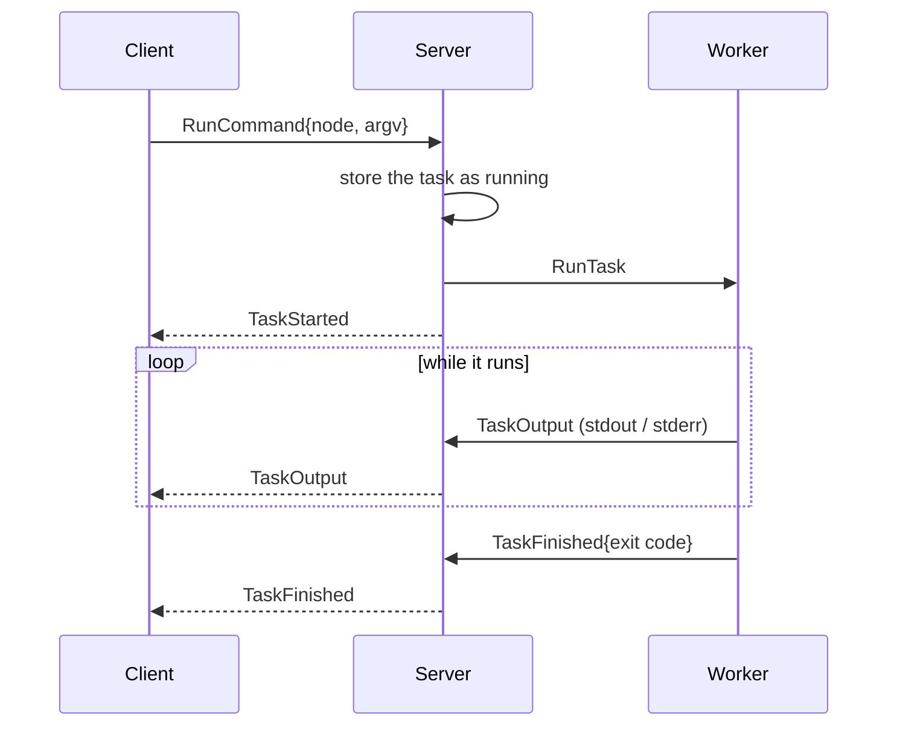

# How it works

For the code layout, see [crates.md](crates.md).

## Overview

- One port (7400) serves two gRPC services: `Control` for clients, `NodeLink`
  for workers.
- **Workers always dial in.** The server never connects to a worker: it sends
  work down the stream the worker opened, so workers can sit behind NAT.
- **SQLite** keeps tokens, nodes and task history. Who is online and who is
  watching which task live in memory only.

## Connecting

### The link

`commandant://<payload>` packs the server's address(es) and a token into a
short string: the bytes are XOR-scrambled, given a checksum and base64url
encoded. This is **obfuscation, not encryption**: it stops the token being read
at a glance and catches typos, but anyone with the link can decode it. A link
can hold several addresses (say a public name and a LAN address); clients try
them all at once and use the first that answers. A client on the server's own
machine connects through `127.0.0.1`.

The server puts the `--advertise` addresses in the link, then its own primary
IP. Under WSL 2's default network that IP is only reachable from Windows; the
server warns about it.

### Tokens

| Prefix | What | Lifetime |
|---|---|---|
| `cmda_` | admin token: the Control API, and joining workers | permanent (`--reset` replaces it) |
| `cmdj_` | join token from `token create`: joining workers only | its TTL, default 1 h |
| `cmdn_` | node secret, given to a worker when it joins | until `node rm` |

Only SHA-256 hashes are compared, in constant time. The admin token is also
kept in full, so the database alone gives back the same link.

### A worker's life

- No message for 30 s: the server drops the connection and the node is offline.
- The worker reconnects with backoff (1 s up to 30 s). It only gives up on bad
  credentials or a name already taken.
- A worker locks its state directory, so two workers are never the same node.
  If a secret still turns up twice, the server keeps the newer connection and
  stops the older worker.
- Workers refuse to run as root.

## Running a task

A task ends `succeeded`, `failed`, `cancelled`, or `lost` (its node
disconnected, or the server restarted). Cancelling kills the task's whole
process group. A client too slow to keep up loses output chunks, never the task.

## Coding agents

A worker hosts at most one **harness** (a coding agent), started with
`--harness` or later when a client asks (`StartHarness`, which may first install
it). Workers announce what they host and what they could host. In the worker,
every harness implements the same `Harness` trait, so the server and clients
only see its name.

A **prompt** is a task like a command: its reply streams as output (text on
stdout, thinking on its own stream, tool calls on stderr) and it can be
cancelled. Everything else is a **question**: the server sends it with a
request id and waits for the matching answer (15 s, or 10 minutes for slow
ones like installing an agent or cloning). Questions list the agent's options
(agents, models, efforts, commands, MCP servers), its saved sessions and a
session's history, sign it in to model providers, and prepare projects.

Many prompts run at once on one node, but a session takes one prompt at a
time. Nobody answers the agent's permission requests, so they are granted;
that gives nothing the admin can't already do with `run`.

### OpenCode

The worker runs `opencode serve` on loopback, behind a random password, and
talks to it over HTTP. One server serves every session and directory. A prompt
subscribes to OpenCode's events, then sends the prompt, and follows its own
session's events until it goes idle. OpenCode lists its MCP servers only once
they have connected (5 to 15 s after it starts), so the options answer without
them at first and the TUI asks again. After a sign-in OpenCode must reload to
see the new models, which would abort running prompts, so the worker reloads
once none is running.

### Claude Code

The worker runs the `claude` CLI once per prompt (`claude -p`, streaming JSON),
with `--session-id` for a new session or `--resume` to continue one. Its options
come from a `claude` asked through its SDK control messages, which costs
nothing. Sessions and their history are read from Claude Code's own transcripts
(`~/.claude/projects`). It stays on the subscription: API key variables are
removed, and a turn stops if Claude Code reports using an API key.

### Projects

`PrepareProject` clones a repository (with libgit2) into a new copy,
`<state>/projects/<name>/<id>`, through a hidden directory so a failed clone
leaves nothing. `ListProjects` lists the copies with their branch and the
sessions working in each. A session works in a copy by using it as its
directory; one that has started keeps its directory.

## What's next

- **TLS** for the gRPC port.
- **Interactive agents**: answer permission requests from the TUI instead of
  granting them.
- **Several harnesses per worker**: prompts would then need to name theirs.
