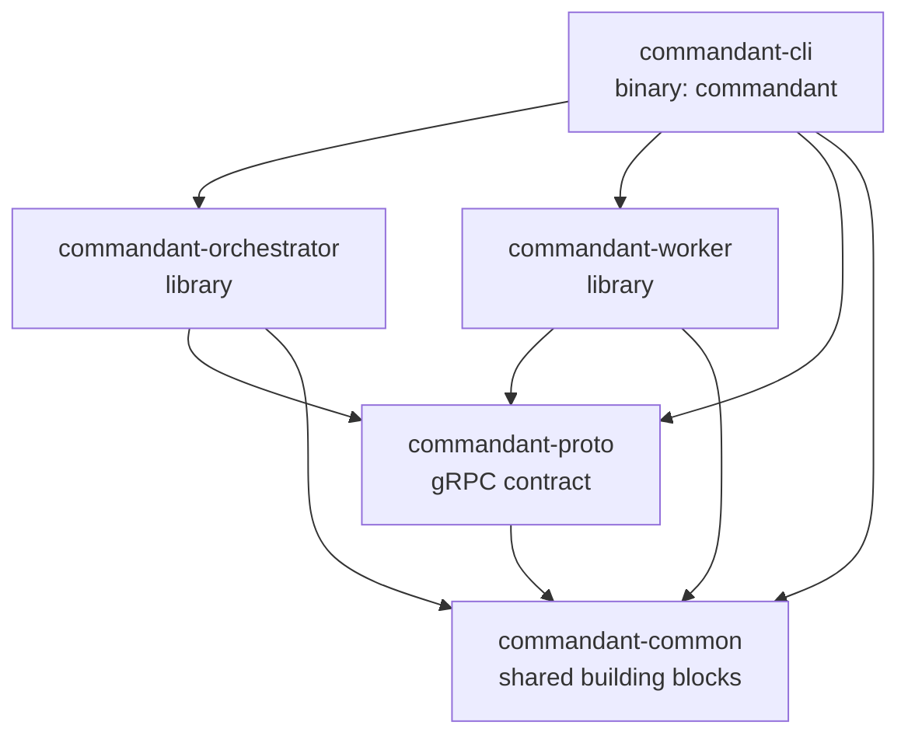

# Crates

The workspace has five crates. For how they interact at runtime, see
[architecture.md](architecture.md).

The orchestrator and worker are libraries, so the CLI binary and the e2e tests
can both run them in-process.

Anything used by more than one crate goes in a shared crate:

- **gRPC types and client connections** go in `commandant-proto`.
- **Everything else** goes in `commandant-common`: files, time, directories,
  links, and id lookup.

---

## `commandant-common`: shared building blocks

It has no gRPC dependency, so every crate can use it.

| Module | Contents |
|---|---|
| `lib.rs` | `DEFAULT_PORT` (7400) and `VERSION` |
| `fs.rs` | `write_private` (a `0600` file, creating parent dirs, written aside then renamed into place so it is never seen half-written), `read_optional` (`None` if the file is missing), `read_trimmed` (a single-value file such as a token). Used for the admin token, link, advertise file, worker `node.json` and client config |
| `time.rs` | `now()` in Unix seconds, used for database timestamps. `ago(ts)` gives `12s ago`-style ages for CLI tables |
| `dirs.rs` | Platform default locations: `server_data()`, `worker_state()`, `client_config()` |
| `lookup.rs` | `find(items, needle, key)`: the item whose key equals `needle`, otherwise the only one it prefixes (`Match::One`/`Ambiguous`/`None`). Used to resolve node ids and task ids |
| `link.rs` | The `Link` type. It prints `commandant://<opaque>`: the host (an IP as bytes, the port only if it isn't 7400) and the token (prefix as a byte, hex as raw bytes) packed, XOR-scrambled with a fixed key, with a format byte and a checksum added, then base64url. It parses that form, the older textual one (format 1) and the plain `commandant://token@host:port`. `Link::for_addr(token, url)` builds a link from an orchestrator URL. `with_port`. `primary_ip()` gives the default advertised host. `prefer_loopback(url)` rewrites to `127.0.0.1` (or `[::1]`) when the host is this machine |

---

## `commandant-proto`: the contract

The gRPC contract, plus the client-side connection helper.

| File | Contents |
|---|---|
| `proto/commandant.proto` | Services `NodeLink` (worker ⇄ orchestrator stream) and `Control` (CLI → orchestrator), plus all messages |
| `build.rs` | Generates Rust code with `tonic-prost-build`, using a vendored `protoc` (nothing to install) |
| `src/lib.rs` | Re-exports the generated types. `From` impls wrap each payload in its envelope, so `Heartbeat {}.into()` gives a `WorkerMsg` (likewise for `OrchestratorMsg` and `TaskEvent`). `Reply` is the shape of a worker's answer to the orchestrator's questions (`AgentOptions`, `AgentSessions`, `HarnessStarted`: a `request_id` and an `error`), and `HOSTS`/`CAN_HOST` the capability prefixes for harnesses. Also holds the `BearerAuth` interceptor, the `ControlClient` alias, and `connect_control(addr, token)`, which goes through `prefer_loopback` |

### Messages at a glance

| Direction | Messages |
|---|---|
| Worker → orchestrator | `Hello` (join token or node credential, plus host facts), `Heartbeat`, `TaskOutput`, `TaskFinished`, `AgentOptions`, `AgentSessions`, `HarnessStarted` |
| Orchestrator → worker | `Welcome` (node id, plus a secret on first join), `RunTask`, `AgentPrompt`, `CancelTask`, `ListAgentOptions`, `ListAgentSessions`, `GetSessionHistory`, `ListProviders`, `ProviderAuth`, `PrepareProject`, `ListProjects`, `StartHarness` |
| CLI → orchestrator | `CreateJoinToken`, `ListNodes`, `RemoveNode`, `RunCommand` and `Prompt` (both stream `TaskEvent`s), `GetAgentOptions`, `SwitchMcpServer`, `ListAgentSessions`, `GetSessionHistory`, `ListProviders`, `AuthenticateProvider`, `PrepareProject`, `ListProjects`, `StartHarness`, `ListTasks`, `CancelTask` |

---

## `commandant-orchestrator`: the control plane

Entry point: `Orchestrator::open(data_dir)` followed by `.serve(listener, shutdown)`.

| Module | Role |
|---|---|
| `lib.rs` | Opens the data dir and its database (`DB_FILE`). Marks tasks left `running` by a previous run as `lost`. Creates the admin token on first start and loads it from the database on later starts (from `admin.token` once, for databases that only kept its hash), rewriting `admin.token`. `admin_token()` returns it. Serves both gRPC services, with HTTP/2 keepalive. Holds `Shared` (store, registry, hub, queries and `AdminTokens`) and `internal()`, which maps unexpected errors to a gRPC status |
| `auth.rs` | Token generation (`cmda_`/`cmdj_`/`cmdn_` + 16 random bytes; older 32-byte tokens still work), SHA-256 hashing, constant-time comparison. `AdminTokens` answers "is this an admin token?" for both the `Control` interceptor and worker joins |
| `link.rs` | `NodeLink` service. Waits up to 10 s for a `Hello` and admits it: `enrol` (a join token, admin or `cmdj_`, creates a node) or `reconnect` (a node credential). It then registers the connection and handles messages until the stream ends or goes idle for 30 s. `forget_connection` marks the node offline and its unfinished tasks `lost` |
| `control.rs` | `Control` service. Resolves nodes by name, id or prefix, creates join tokens, and lists/removes nodes. `run_command` and `prompt` share `dispatch`: it stores the task, registers it in the hub, sends `RunTask` or `AgentPrompt`, and `relay`s events back to the CLI. `prompt` first checks that the node has a harness. `cancel_task` sends `CancelTask` to the node that owns the task. `get_agent_options` and `switch_mcp_server` send `ListAgentOptions` (the latter with an `McpSwitch`) and wait up to 15 s for the answer. `start_harness` checks the node can host the harness, sends `StartHarness`, and waits up to 10 minutes; the worker refuses another harness than the one it hosts. All of them go through `ask`, which waits for the typed answer and turns its `error` into a failure |
| `queries.rs` | `Queries`: requests to workers awaiting an answer, keyed by request id. `open` returns the id and a receiver, `answer` delivers a worker's answer (any message with a `request_id`), `close` forgets a request that timed out |
| `registry.rs` | In-memory map from node id to its live connection: a sender, a unique `ConnId`, the harnesses the worker hosts and those it can host (`set_harnesses` records one started later). A new connection replaces the old one, and a stale disconnect can't evict a newer connection. `disconnect_all` ends every worker stream at shutdown, which a graceful shutdown would otherwise wait on forever. A connection replaced while its worker still listens is told another worker has its credentials, which stops that worker |
| `tasks.rs` | `TaskHub`: running tasks, each with a `broadcast` channel that fans out output to CLI streams. Each task records its `Owner` (node and connection), and events are accepted only from that connection. `fail_connection` ends all tasks of a dropped connection |
| `store.rs` | SQLite via `sqlx` (WAL mode). Queries for admin/join tokens, nodes and tasks. Rows map to `NodeRecord`/`TaskRecord` via `sqlx::FromRow` (argv is stored as JSON). Task statuses are typed (`TaskStatus::of(&finished)`), and `lose_task` records a task whose node disconnected. Migrations run on open. The database file and its `-wal`/`-shm` are made owner-only |
| `migrations/0001_init.sql` | Tables `admin_tokens`, `join_tokens`, `nodes`, `tasks` |
| `migrations/0002_admin_token.sql` | `admin_tokens.token`: the admin token in full, so the database alone keeps the link |

---

## `commandant-worker`: runs the work

Entry point: `commandant_worker::run(WorkerConfig { server, join_token, name, state_dir, pick_free_state_dir, harness, opencode_bin })`.
It sets up the harness, if any, then runs until a fatal error occurs.

| Module | Role |
|---|---|
| `lib.rs` | Reconnect loop with exponential backoff (1 s → 30 s, reset after a healthy session). A `session` connects (via loopback when the orchestrator is local), sends `Hello`, waits for `Welcome` and saves credentials when they're new or the server URL changed. `serve` then handles `RunTask`/`AgentPrompt`/`CancelTask` and the questions (`ListAgentOptions`, `ListAgentSessions`, `GetSessionHistory`, `ListProviders`, `ProviderAuth`, `StartHarness`), each answered in the background by `ask_harness`/`answer`, going through the hosted `Harness` for the agent ones, while sending a `Heartbeat` every 10 s. Errors are `Fatal` (auth, name conflict), `Stale` (saved credentials refused on the first connection while a join token was given: it deletes them and joins again with the token) or `Retry` (anything else). Questions from the orchestrator are answered through `reply`, which fills in the request id, or the error |
| `exec.rs` | Runs one command: no shell, stdin closed, its own process group, optional `cwd`/`env`. Streams stdout/stderr in 16 KiB chunks. Cancelling sends `SIGKILL` to the whole group. After the process exits, output is drained for up to 2 s. Reports the exit code, or the signal as an error |
| `state.rs` | `node.json` in the state dir: `{node_id, secret, server}`, written `0600`. `harness` holds the harness a client had it start, to start again after a restart. `claim` locks the directory for the worker's lifetime (released if it dies), or picks the first free `<dir>-2`, `-3`… when asked |
| `project.rs` | Answers `PrepareProject` and `ListProjects` with `git2`: clones a new copy of a project into `<state>/projects/<name>/<id>` (through a hidden directory, credentials from the SSH agent, key files or credential helper, never prompting), from a URL or from the origin of a copy it has; lists projects and their copies, latest first, with their branch and the titles of the sessions working in them |
| `harness.rs` | `HarnessKind` (`Opencode`, `ClaudeCode`), parsed from `--harness`, announced as `harness:<name>` when hosted and `can-host:<name>` otherwise. The `Harness` trait (`prompt`, `options`, `sessions`), and `Host`: what the worker hosts (nothing, one being started, or one running), kept across connections. `Host::start` is the one way to start one, from `--harness` or a client, and refuses a second start or another harness |
| `claude/mod.rs` | `ClaudeCode`: the `claude` binary (given, found, or installed with `claude.ai/install.sh`) and the saved `setup-token`. `command()` runs `claude` in a directory, in its own process group, without API key variables and with the token if any. Options come from `initialize` + `mcp_status` control requests to a `claude` given no prompt. Signing in stores or removes the token (or runs `claude auth logout`) |
| `claude/stream.rs` | One prompt: `claude -p` with stream-json, `--session-id`/`--resume`, model, effort, agent. `Turn` follows the events (top-level only): text and thinking deltas, tool calls and failed results as `[claude-code] …` notes, the `result` as `TaskFinished` with no cost; an `init` naming an API key stops the turn |
| `claude/sessions.rs` | Lists the latest transcripts under `~/.claude/projects` (title from `custom-title`/`ai-title`, else the first prompt; directory; last model), a session's history, and its directory for `--resume` |
| `opencode/mod.rs` | `Opencode::start()` runs the given `opencode`, else finds one (on `PATH` or in `~/.opencode/bin`) or runs the official installer with `--no-modify-path`. It then starts `opencode serve` on loopback with a random `OPENCODE_SERVER_PASSWORD`, reading the URL from its output. `api()` restarts the server if it has died. `busy` (the shared `Busy`) marks a session busy while a prompt runs in it, refusing a second one. Dropping it stops the server's whole process group. It implements `Harness` |
| `opencode/api.rs` | A small `reqwest` client for the endpoints used: health, create/get session, `prompt_async` (with model, agent and variant), `command`, abort, permission reply, agents, providers, config, commands, MCP status and connect/disconnect, and the `/event` server-sent event stream |
| `opencode/options.rs` | Answers `ListAgentOptions`: the agents a prompt can use (no subagents or hidden ones), each provider's models (deprecated ones left out) with their context windows and efforts ordered from least to most, and the defaults, plus the commands and skills and the MCP servers (switching one first when asked). The commands and MCP servers get 2 s; past that the answer says `loading` |
| `opencode/sessions.rs` | Answers `ListAgentSessions`: the latest top-level sessions in every directory, with their title, directory, last agent, model and effort, cost, and whether a prompt is running in them; and `GetSessionHistory`: a session's prompts, replies, thinking and tool calls from `GET /session/:id/message`, the latest 300 entries |
| `opencode/auth.rs` | Answers `ListProviders` (every provider from `GET /provider`, signed-in ones first, with the sign-in methods `GET /provider/auth` lists, else an API key) and `ProviderAuth`: an API key (`PUT /auth/:id`), signing out (`DELETE`), or OAuth in two steps (`/oauth/authorize` gives a URL and whether a code comes back; `/oauth/callback` finishes, waiting for the browser when there's no code). OpenCode only lists a new provider's models after `POST /global/dispose`, which aborts running prompts, so changing credentials marks the server stale and `options` or the next prompt reloads it once no prompt runs (prompts hold `quiet` shared, the reload takes it exclusively) |
| `opencode/prompt.rs` | Runs one `AgentPrompt`: picks the directory, creates or continues the session, subscribes to events, then prompts, or runs the `command` (checked against `/command`) beside the event stream. `Transcript` keeps only this session's assistant output: text deltas go to stdout (with catch-up for text that came without deltas), thinking to the reasoning stream, finished tool calls to stderr. It adds up each reply's tokens and cost for `TaskFinished`. It grants permission requests, records `session.error`, and finishes when the session goes idle. Cancelling aborts the session |

When a session ends, all of its running tasks are killed. Dropping the cancel
senders triggers the kill, and the orchestrator marks those tasks `lost`.

---

## `commandant-cli`: the `commandant` binary

| File | Role |
|---|---|
| `src/main.rs` | Sets up logging and dispatches each command to its module. Maps errors to exit code 1 |
| `src/cli.rs` | The `clap` command tree (`server`, `worker`, `login`, `token create`, `node ls/rm/start-agent/sessions/commands/mcp`, `run`, `prompt`, `tui`, `task ls/cancel`) and its value parsers |
| `src/server.rs` | Binds the port, then (with `--reset`, after two confirmations) deletes the database, admin token, link and local worker credentials. Opens the orchestrator, works out the advertised host, prints and saves the link, and optionally spawns the in-process local worker (with its harness). It stops that worker before exiting, so the harness server doesn't outlive it |
| `src/worker.rs` | Picks the orchestrator and token from a link, flags, or the remembered server, then runs the worker |
| `src/admin.rs` | `login`, `token create`, `node ls/rm/start-agent/sessions/commands/mcp` and `task ls/cancel`, with their table output |
| `src/run.rs` | `run` and `prompt`: stream stdout/stderr (leaving out the agent's thinking), map Ctrl-C to cancel then detach, exit with the task's exit code, and print the session to continue after a prompt |
| `src/tui/mod.rs` | `tui`: lists the nodes (or opens the one named), runs the terminal and the event loop (keys, updates drained in batches, a spinner tick only while something works), and carries out actions: prompts streamed to their chat, cancels, agent options, MCP switches and saved sessions fetched per node, and the nodes refreshed every 5 s |
| `src/tui/app.rs` | The whole UI: the node list, every open chat on every node, which one is shown, each node's options and saved sessions, and the session picker. Routes updates to their chat (or every chat on a node) and handles Ctrl-N, Ctrl-O, Alt-←/→, Ctrl-W and Ctrl-G, passing other keys to the shown chat; unit-tested without a terminal. A node without an agent opens a harness picker; choosing starts it (`StartHarness`), and the node opens once it's ready |
| `src/tui/chat.rs` | One chat's state (node, settings, agent options, thread with streamed replies and thinking, a summary per turn, session cost and context use, input, activity, open picker, whether a turn ended out of sight) and how keys, slash commands and task events change it: Tab cycles agents, Ctrl-T efforts, `/model`, `/effort`, `/agent`, `/skills` and `/mcp` open pickers, `/<command> args` runs one of the agent's commands, Esc cancels (once the task starts, if pressed before); unit-tested without a terminal. `COMMANDS` and `KEYS` list the chat's own commands and keys once, for `/help`, the welcome text and completion: typing `/name` shows the matching commands (the chat's, then the agent's) over the prompt; ↑↓ pick, Tab fills one in, Enter on a partial name runs the one picked |
| `src/tui/ui.rs` | Draws it with ratatui, almost without borders: the node list (with each node's open and working chats), or a chat: a header line with the node's details, a tab per chat on the node (spinner while working, a mark when one finished out of sight), the thread with a gutter per kind of entry (following the bottom unless scrolled), a status line saying what the agent does, or what is still loading (its options, MCP servers, a resumed session's history) with a spinner, else whether its MCP servers are connected, the prompt on a solid slab, a footer with the agent, model, effort, context use and cost, and the floating picker |
| `src/tui/text.rs` | Styles the agent's markdown (headings, lists, quotes, fenced and inline code, bold) and wraps lines at words behind their gutter |
| `src/tui/picker.rs` | `Picker<T>`: the floating list of choices carrying what choosing them means (a chat's `Choose`, the app's `AppChoice`), narrowed by typing (every word must match), moved with the arrows and chosen with Enter |
| `src/config.rs` | Client settings: flags and env first, then `~/.config/commandant/config.toml`. `Client::connect()` opens the Control connection |
| `tests/e2e.rs` | Starts a real orchestrator and worker in-process on a random port and checks: admin auth, stale credentials giving way to a fresh token (and failing without one, and the rejoined worker coming back as its new node after a restart), a taken name, a node removed while running stopping at once, several workers started at once from one state directory becoming separate nodes that stay connected (and a held `--state-dir` refused), copied credentials stopping the older worker, join, output and exit codes, process-group cancel, a prompt refused without a harness, task history, reconnect with stored credentials, a spent token being rejected, a join through the short admin link, a restart that keeps the link and the node ids, and (Unix) `commandant server --reset` in a pseudo-terminal: refused without a terminal, cancelled by any other answer, and on `y` then `reset` a new admin token that the local worker rejoins with. (Unix) A worker hosting a fake OpenCode runs the agent features end to end: prompts side by side without their output mixing, a busy session refusing a second prompt while others carry on, cancelling (the turn aborted, the session freed), saved sessions latest first with busy ones marked (also from an OpenCode without `/experimental/session`), commands checked before they run, agent options and MCP switches (unknown or unnamed servers refused), a failing turn, a granted permission, the chosen model, agent and effort reaching OpenCode, a malformed model, an unknown session, a worker stopping mid-turn aborting its turns, a node without a harness starting the one it's asked for (refusing others) and hosting none again after a restart, and options not waiting for slow commands |
| `tests/fake_opencode/` | The fake: a script the worker runs as `opencode`, printing the address of an HTTP server in the test process. It answers the endpoints the worker uses and plays each turn as events: `hold` waits to be released or aborted, `fail` ends in a session error, `permission` asks first. Tests read its request log |

---

## Other files

| Path | |
|---|---|
| `docker/Dockerfile` | Multi-stage build to a slim Debian image with `commandant`, `git`, `curl` and CA certificates. `/data` holds server state, `/state` holds worker state |
| `docker/orchestrator.compose.yml` | Orchestrator deployment (host networking, optional local worker) |
| `docker/worker.compose.yml` | A single worker joining through `COMMANDANT_LINK`, optionally with `COMMANDANT_HARNESS`. `/root` is a volume, so an installed harness and its sessions persist |
| `docker-compose.yml` | Single-host dev cluster: one orchestrator and two workers |
