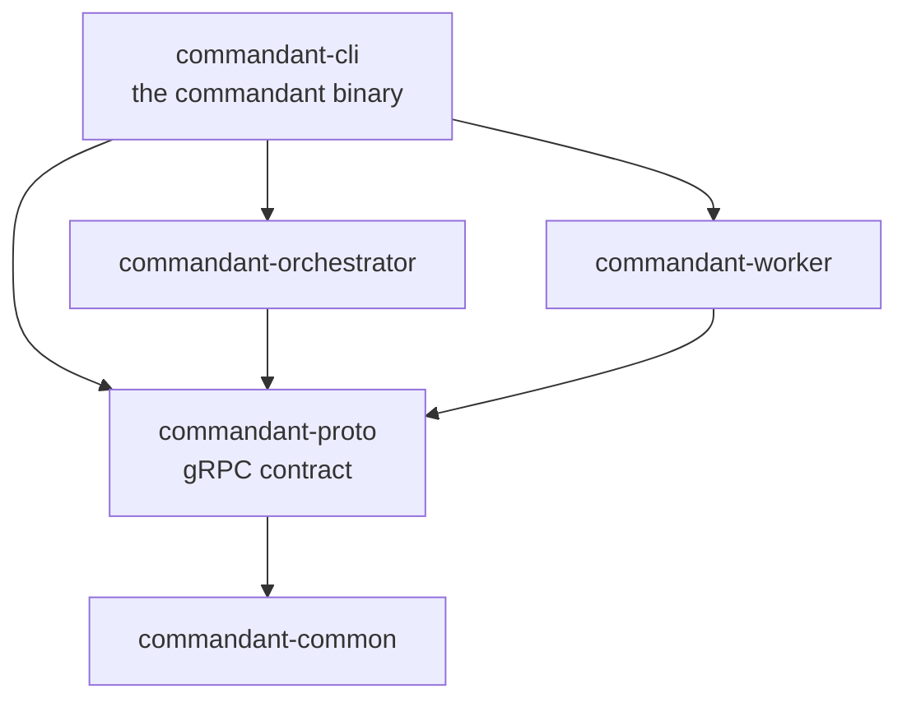

# Code layout

Five crates. For how they work together at runtime, see
[architecture.md](architecture.md).

The server and the worker are libraries, so the binary and the end-to-end tests
both run them in-process. Code used by several crates goes in
`commandant-proto` (anything gRPC) or `commandant-common` (everything else).

## `commandant-common`

| File | |
|---|---|
| `lib.rs` | `DEFAULT_PORT`, `VERSION`, `or` |
| `link.rs` | The `commandant://` link: encoding, parsing, addresses, loopback for the local machine |
| `fs.rs` | Private (0600) files, written atomically; reading optional and single-value files |
| `dirs.rs` | Default data, state and config directories |
| `lookup.rs` | Finding a node or task by id or id prefix |
| `time.rs` | Unix time, and `12s ago` for tables |

## `commandant-proto`

| File | |
|---|---|
| `proto/commandant.proto` | The contract: `NodeLink` (worker ⇄ server) and `Control` (client → server) |
| `src/lib.rs` | Generated types, `.into()` for message envelopes, the `Reply` trait for answers to questions, and connecting (`channel` tries every address of a link) |

`protoc` is vendored: editing the `.proto` only needs a rebuild.

## `commandant-orchestrator`

| File | |
|---|---|
| `lib.rs` | Opens the data directory, sets up the admin token, serves both services |
| `link.rs` | `NodeLink`: admits workers (join or reconnect) and handles their messages |
| `control.rs` | `Control`: the admin API; sends tasks and questions to workers |
| `registry.rs` | Which node is connected, on which connection, with which harnesses |
| `tasks.rs` | Fans live task output out to watching clients |
| `queries.rs` | Matches workers' answers to the questions asked, by request id |
| `store.rs` | SQLite: tokens, nodes, tasks (migrations in `migrations/`) |
| `auth.rs` | Token generation, hashing, constant-time checks |

## `commandant-worker`

| File | |
|---|---|
| `lib.rs` | Connects and reconnects, then runs tasks and answers questions |
| `state.rs` | `node.json` (credentials), and the state-directory lock |
| `exec.rs` | Runs a command in its own process group and streams its output |
| `project.rs` | Clones and lists projects and their copies (git2) |
| `harness.rs` | The `Harness` trait, the `Host` of the running harness, and what harnesses share (session lock, installer, output writer) |
| `opencode/` | OpenCode: the server process (`mod.rs`), its HTTP API (`api.rs`), prompts (`prompt.rs`), options, sessions and sign-in |
| `claude/` | Claude Code: the CLI (`mod.rs`), one prompt's stream (`stream.rs`), sessions from its transcripts (`sessions.rs`) |

## `commandant-cli`

| File | |
|---|---|
| `main.rs`, `cli.rs` | Logging, and the command line (clap) |
| `server.rs`, `worker.rs` | `server` (link, reset, local worker) and `worker` |
| `admin.rs`, `run.rs` | `login`, `token`, `node`, `task`; `run` and `prompt` |
| `config.rs` | Where clients find the server and token |
| `tui/mod.rs` | The TUI's event loop: draws, reads keys, makes the calls actions ask for |
| `tui/app.rs` | The nodes and every chat; routes keys and updates |
| `tui/chat.rs` | One chat: its session, settings, thread, input, commands |
| `tui/ui.rs`, `tui/text.rs` | Drawing, and markdown styling |
| `tui/picker.rs` | The floating list to choose from |
| `tests/e2e.rs` | End-to-end tests with a real server and workers in-process |
| `tests/fake_opencode/` | A fake OpenCode the tests drive (`hold`, `fail`, `permission` in a prompt) |

## Other files

| Path | |
|---|---|
| `docker/Dockerfile` | The image: `commandant`, `git`, `curl`, run as user `commandant` |
| `docker/*.compose.yml` | Orchestrator and worker deployments |
| `docker-compose.yml` | A server and two workers on one host, for development |
