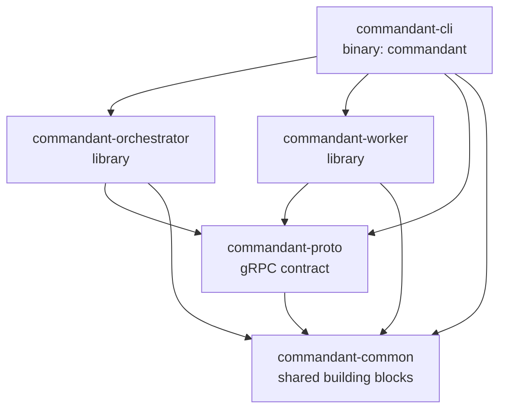

# Crates

The workspace has five crates. For how they interact at runtime, see
[architecture.md](architecture.md).

The orchestrator and worker are libraries, so the CLI binary and the e2e tests
can both run them in-process.

Anything used by more than one crate goes in a shared crate:

- **gRPC types and client connections** go in `commandant-proto`.
- **Everything else** goes in `commandant-common`: files, time, directories,
  links, and id lookup.

---

## `commandant-common`: shared building blocks

It has no gRPC dependency, so every crate can use it.

| Module | Contents |
|---|---|
| `lib.rs` | `DEFAULT_PORT` (7400) and `VERSION` |
| `fs.rs` | `write_private` (a `0600` file, creating parent dirs), `read_optional` (`None` if the file is missing), `read_trimmed` (a single-value file such as a token). Used for the admin token, link, advertise file, worker `node.json` and client config |
| `time.rs` | `now()` in Unix seconds, used for database timestamps. `ago(ts)` gives `12s ago`-style ages for CLI tables |
| `dirs.rs` | Platform default locations: `server_data()`, `worker_state()`, `client_config()` |
| `lookup.rs` | `find(items, needle, key)`: the item whose key equals `needle`, otherwise the only one it prefixes (`Match::One`/`Ambiguous`/`None`). Used to resolve node ids and task ids |
| `link.rs` | The `Link` type. It prints `commandant://<opaque>`: `token@host:port` XOR-scrambled with a fixed key, with a format byte and a checksum added, then base64url. It parses both that form and the plain `commandant://token@host:port`. `Link::for_addr(token, url)` builds a link from an orchestrator URL. `with_port`. `primary_ip()` gives the default advertised host. `prefer_loopback(url)` rewrites to `127.0.0.1` (or `[::1]`) when the host is this machine |

---

## `commandant-proto`: the contract

The gRPC contract, plus the client-side connection helper.

| File | Contents |
|---|---|
| `proto/commandant.proto` | Services `NodeLink` (worker ⇄ orchestrator stream) and `Control` (CLI → orchestrator), plus all messages |
| `build.rs` | Generates Rust code with `tonic-prost-build`, using a vendored `protoc` (nothing to install) |
| `src/lib.rs` | Re-exports the generated types. `From` impls wrap each payload in its envelope, so `Heartbeat {}.into()` gives a `WorkerMsg` (likewise for `OrchestratorMsg` and `TaskEvent`). Also holds the `BearerAuth` interceptor, the `ControlClient` alias, and `connect_control(addr, token)`, which goes through `prefer_loopback` |

### Messages at a glance

| Direction | Messages |
|---|---|
| Worker → orchestrator | `Hello` (join token or node credential, plus host facts), `Heartbeat`, `TaskOutput`, `TaskFinished` |
| Orchestrator → worker | `Welcome` (node id, plus a secret on first join), `RunTask`, `AgentPrompt`, `CancelTask` |
| CLI → orchestrator | `CreateJoinToken`, `ListNodes`, `RemoveNode`, `RunCommand` and `Prompt` (both stream `TaskEvent`s), `ListTasks`, `CancelTask` |

---

## `commandant-orchestrator`: the control plane

Entry point: `Orchestrator::open(data_dir)` followed by `.serve(listener, shutdown)`.

| Module | Role |
|---|---|
| `lib.rs` | Opens the data dir and database. Marks tasks left `running` by a previous run as `lost`. Creates the admin token on first start (`admin.token`) and loads it on later starts. `admin_token()` returns it. Serves both gRPC services, with HTTP/2 keepalive. Holds `Shared` (store, registry, hub and `AdminTokens`) and `internal()`, which maps unexpected errors to a gRPC status |
| `auth.rs` | Token generation (`cmda_`/`cmdj_`/`cmdn_` + 32 random bytes), SHA-256 hashing, constant-time comparison. `AdminTokens` answers "is this an admin token?" for both the `Control` interceptor and worker joins |
| `link.rs` | `NodeLink` service. Waits up to 10 s for a `Hello` and admits it: `enrol` (a join token, admin or `cmdj_`, creates a node) or `reconnect` (a node credential). It then registers the connection and handles messages until the stream ends or goes idle for 30 s. `forget_connection` marks the node offline and its unfinished tasks `lost` |
| `control.rs` | `Control` service. Resolves nodes by name, id or prefix, creates join tokens, and lists/removes nodes. `run_command` and `prompt` share `dispatch`: it stores the task, registers it in the hub, sends `RunTask` or `AgentPrompt`, and `relay`s events back to the CLI. `prompt` first checks that the node has a harness. `cancel_task` sends `CancelTask` to the node that owns the task |
| `registry.rs` | In-memory map from node id to its live connection: a sender, a unique `ConnId`, and the harnesses the worker announced. A new connection replaces the old one, and a stale disconnect can't evict a newer connection. `disconnect_all` ends every worker stream at shutdown, which a graceful shutdown would otherwise wait on forever |
| `tasks.rs` | `TaskHub`: running tasks, each with a `broadcast` channel that fans out output to CLI streams. Each task records its `Owner` (node and connection), and events are accepted only from that connection. `fail_connection` ends all tasks of a dropped connection |
| `store.rs` | SQLite via `sqlx` (WAL mode). Queries for admin/join tokens, nodes and tasks. Rows map to `NodeRecord`/`TaskRecord` via `sqlx::FromRow` (argv is stored as JSON). Task statuses are typed (`TaskStatus::of(&finished)`), and `lose_task` records a task whose node disconnected. Migrations run on open |
| `migrations/0001_init.sql` | Tables `admin_tokens`, `join_tokens`, `nodes`, `tasks` |

---

## `commandant-worker`: runs the work

Entry point: `commandant_worker::run(WorkerConfig { server, join_token, name, state_dir, harness })`.
It sets up the harness, if any, then runs until a fatal error occurs.

| Module | Role |
|---|---|
| `lib.rs` | Reconnect loop with exponential backoff (1 s → 30 s, reset after a healthy session). A `session` connects (via loopback when the orchestrator is local), sends `Hello`, waits for `Welcome` and saves credentials when they're new or the server URL changed. `serve` then handles `RunTask`/`AgentPrompt`/`CancelTask` while sending a `Heartbeat` every 10 s. Errors are either `Fatal` (auth, name conflict) or `Retry` (anything else) |
| `exec.rs` | Runs one command: no shell, stdin closed, its own process group, optional `cwd`/`env`. Streams stdout/stderr in 16 KiB chunks. Cancelling sends `SIGKILL` to the whole group. After the process exits, output is drained for up to 2 s. Reports the exit code, or the signal as an error |
| `state.rs` | `node.json` in the state dir: `{node_id, secret, server}`, written `0600` |
| `harness.rs` | `HarnessKind` (just `Opencode` today), parsed from `--harness` and announced as the capability `harness:<name>` |
| `opencode/mod.rs` | `Opencode::start()` finds `opencode` (on `PATH` or in `~/.opencode/bin`) or runs the official installer with `--no-modify-path`. It then starts `opencode serve` on loopback with a random `OPENCODE_SERVER_PASSWORD`, reading the URL from its output. `api()` restarts the server if it has died. Dropping it stops the server's whole process group |
| `opencode/api.rs` | A small `reqwest` client for the endpoints used: health, create/get session, `prompt_async`, abort, permission reply, and the `/event` server-sent event stream |
| `opencode/prompt.rs` | Runs one `AgentPrompt`: picks the directory, creates or continues the session, subscribes to events, then prompts. `Transcript` keeps only this session's assistant output: text deltas go to stdout (with catch-up for text that came without deltas), finished tool calls to stderr. It grants permission requests, records `session.error`, and finishes when the session goes idle. Cancelling aborts the session |

When a session ends, all of its running tasks are killed. Dropping the cancel
senders triggers the kill, and the orchestrator marks those tasks `lost`.

---

## `commandant-cli`: the `commandant` binary

| File | Role |
|---|---|
| `src/main.rs` | Sets up logging and dispatches each command to its module. Maps errors to exit code 1 |
| `src/cli.rs` | The `clap` command tree (`server`, `worker`, `login`, `token create`, `node ls/rm`, `run`, `prompt`, `tui`, `task ls/cancel`) and its value parsers |
| `src/server.rs` | Opens the orchestrator, works out the advertised host, prints and saves the link, and optionally spawns the in-process local worker (with its harness). It stops that worker before exiting, so the harness server doesn't outlive it |
| `src/worker.rs` | Picks the orchestrator and token from a link, flags, or the remembered server, then runs the worker |
| `src/admin.rs` | `login`, `token create`, `node ls/rm` and `task ls/cancel`, with their table output |
| `src/run.rs` | `run` and `prompt`: stream stdout/stderr, map Ctrl-C to cancel then detach, exit with the task's exit code, and print the session to continue after a prompt |
| `src/tui/mod.rs` | `tui`: picks the node, runs the terminal and the event loop (keys, task events, a spinner tick), sends prompts and cancels, and refreshes the node's details |
| `src/tui/app.rs` | The chat state (node, settings, thread, input, activity) and how keys and task events change it; unit-tested without a terminal |
| `src/tui/ui.rs` | Draws it with ratatui: agent details, the thread (following the bottom unless scrolled), and the prompt line |
| `src/config.rs` | Client settings: flags and env first, then `~/.config/commandant/config.toml`. `Client::connect()` opens the Control connection |
| `tests/e2e.rs` | Starts a real orchestrator and worker in-process on a random port and checks: admin auth, join, output and exit codes, process-group cancel, a prompt refused without a harness, task history, reconnect with stored credentials, a spent token being rejected, and a join through the admin link |

---

## Other files

| Path | |
|---|---|
| `docker/Dockerfile` | Multi-stage build to a slim Debian image with `commandant`, `git`, `curl` and CA certificates. `/data` holds server state, `/state` holds worker state |
| `docker/orchestrator.compose.yml` | Orchestrator deployment (host networking, optional local worker) |
| `docker/worker.compose.yml` | A single worker joining through `COMMANDANT_LINK`, optionally with `COMMANDANT_HARNESS`. `/root` is a volume, so an installed harness and its sessions persist |
| `docker-compose.yml` | Single-host dev cluster: one orchestrator and two workers |
